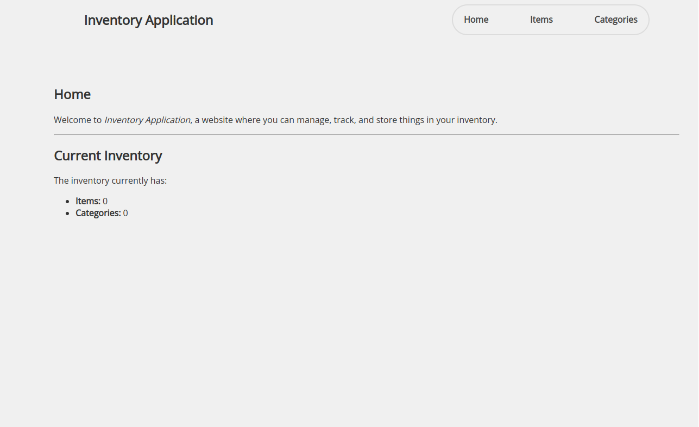

# inventory-application

# Overview

Inventory Application for [The Odin Project](https://www.theodinproject.com/lessons/nodejs-inventory-application)

## Preview



## The process

### Built with

- Pug
- Node (Express)
- MongoDB

### Running locally

To run the application locally:

1. Install the necessary dependencies:

```
npm install
```

2. Start the application:

```
npm run start
```

## Conclusion

This inventory application includes all of the CRUD methods for both items and categories. It mainly uses Express and all of the items and categories are stored in MongoDB. With this project I've gained some practical experience in handling data operations and implementing a user-friendly interface. Although a large majority of this project does come from the MDN Local Library tutorial series I think so far it is a great stepping stone!
